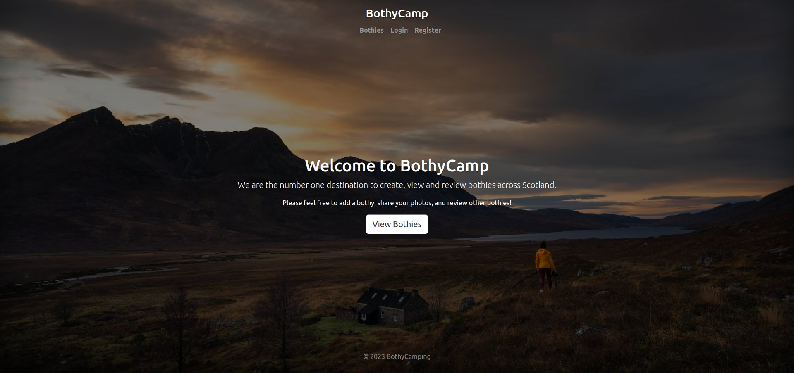
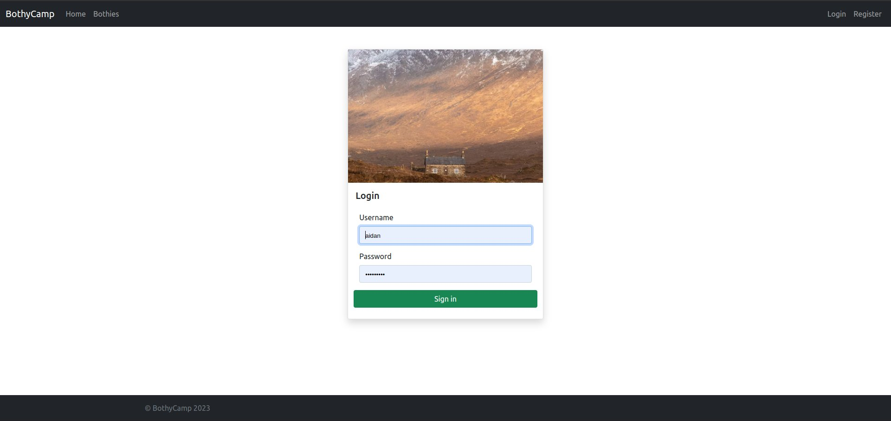
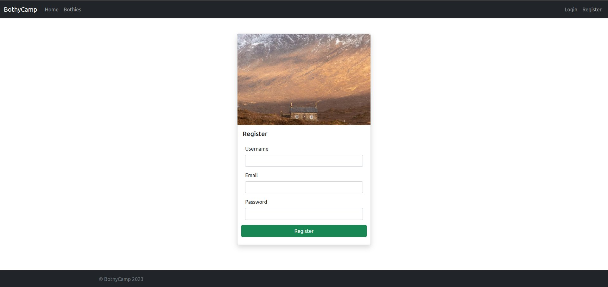
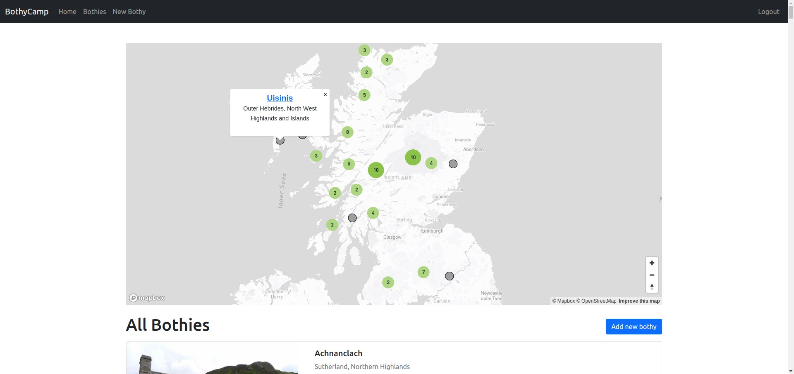
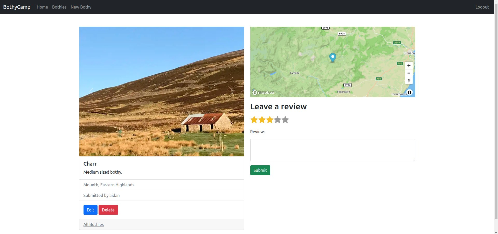
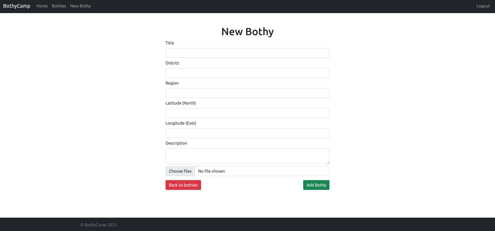

# Bothy Camp 

[See the project live](https://bothycamp.fly.dev)

## About the project

- MERN project
- Using Mongoose / Express / EJS / Node
- CRUD functionality
- Login / Register / Logout
- Create / Edit / Review / Delete a Bothy
- Mongoose Atlas stores all users, reviews, and bothies
- Express used for routing
- Express middleware used for user verification among other things
- Photo upload using Cloudinary
- Cluster map and individual maps from Mapbox API

## How to Use

1. Create an account or login from the main page
2. From the bothies list, add a new bothy or open an existing one
3. Optionally, use the cluster map at the top of the main page to view bothy locations
3. When viewing an existing bothy that you own, you have edit and delete permissions
4. Add or remove photos under the edit screen for each individual bothy
5. Leave a review for any bothy within its own individual page

## Screenshots

## Future Improvements

1. Enforce a maximum file size for photo uploads
2. Enforce a maximum number of photos per bothy